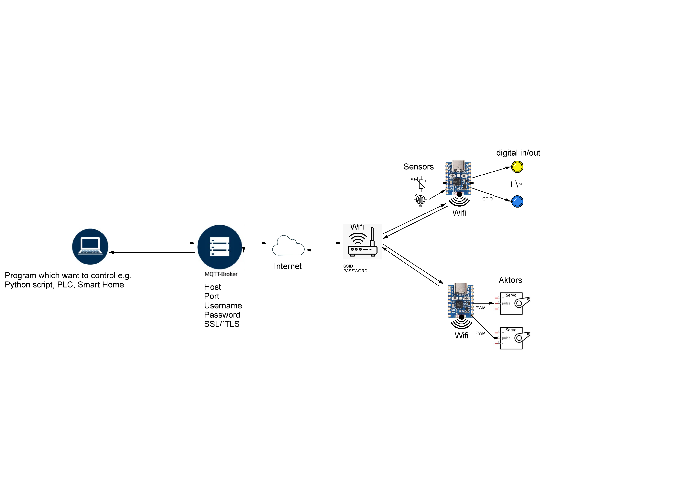
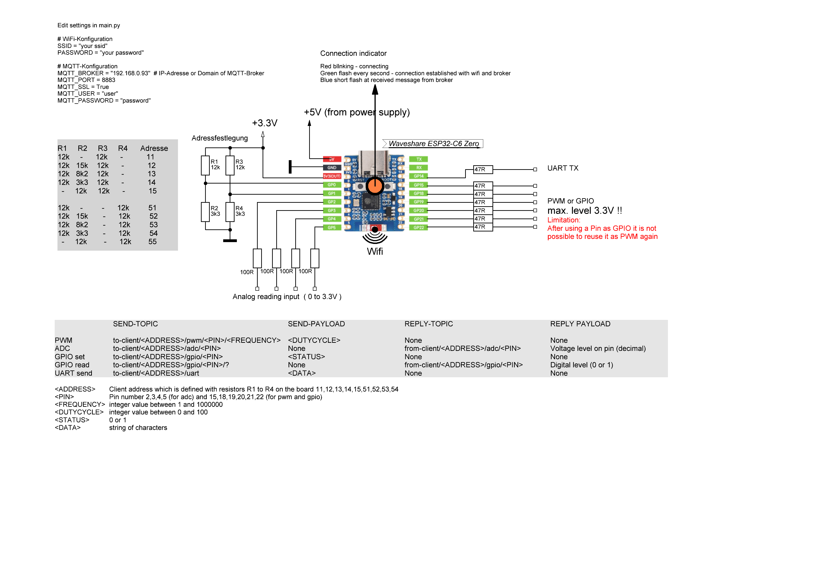

## Remote Peripheral Control with ESP32
### Overview

An other MQTT client is used to control peripherals by publishing messages to an MQTT broker.   
The messages are received by this client.   
This allows for remote control and automation of devices connected to the network. 
## Limitations
After using pin as gpio output it cannot be used as pwm pin  
(workaround: use pin always as pwm and change duty between 0 and 100)
MQTT send topics

